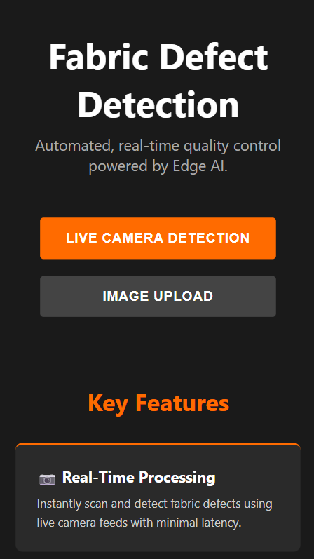
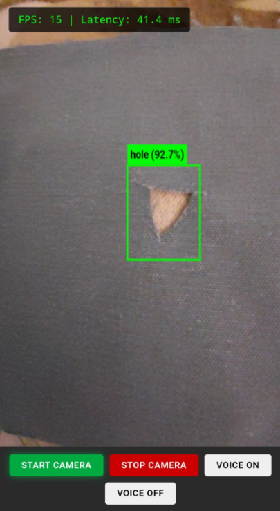
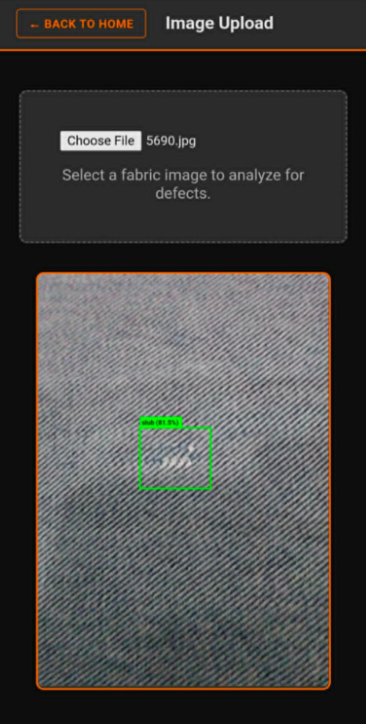

# Fabric Defect Detection System

A browser-based AI prototype for detecting and classifying fabric defects in real time using **MediaPipe Tasks Vision** and **TensorFlow Lite**.

The application analyzes fabric through either a **live camera feed** or an **uploaded image**. Detected regions are highlighted with bounding boxes, classified by a secondary model, and displayed with confidence scores. Optional voice alerts can announce detected defects.

> **Project Status:** Prototype / Proof of Concept

## Live Demo

🔗 **Live Demo:** [https://fabric-defect-system-2.vercel.app](https://fabric-defect-system-2.vercel.app)

---

## Screenshots

### Home



### Live Camera Detection



### Image Upload Analysis



---

## Features

- **Live camera detection** — Analyze fabric defects directly from a live camera feed.
- **Image upload analysis** — Upload a fabric image for inspection.
- **Object detection** — Identifies candidate defect regions using a TensorFlow Lite model.
- **Defect classification** — Classifies detected regions using a second TensorFlow Lite model.
- **Bounding-box visualization** — Displays detected regions and labels directly on a canvas.
- **Confidence scores** — Shows prediction confidence for detected defects.
- **Confidence-based highlighting** — Detection boxes visually differentiate prediction confidence.
- **Voice alerts** — Uses the browser's Speech Synthesis API to announce detected defects.
- **Performance metrics** — Displays FPS and inference latency during live detection.
- **Browser-based inference** — AI processing runs locally in the browser without requiring a backend server.

---

## How It Works

The application uses a **two-stage computer vision pipeline**:

```text
Camera / Uploaded Image
          │
          ▼
   Object Detector
          │
          ▼
   Detected Regions
          │
          ▼
   Crop Each Region
          │
          ▼
   Image Classifier
          │
          ▼
Label + Confidence
          │
          ├──► Canvas Overlay
          │
          └──► Optional Voice Alert
```

For live detection, the application continuously processes video frames using `requestAnimationFrame()`.

The object detector first identifies potential defect regions. Each detected region is then cropped and passed to the image classifier to determine the defect type and confidence.

This two-stage approach separates **defect localization** from **defect classification**.

---

## Technology Stack

| Technology | Purpose |
|---|---|
| HTML5 | Application structure and UI |
| CSS3 | Styling, layout, and responsive design |
| JavaScript (ES Modules) | Application logic |
| MediaPipe Tasks Vision | Object detection and image classification |
| TensorFlow Lite | Machine learning model format |
| WebAssembly | Browser-side MediaPipe runtime |
| Canvas API | Detection overlays and visualization |
| `getUserMedia()` | Camera access |
| FileReader API | Uploaded image handling |
| Speech Synthesis API | Voice notifications |
| `requestAnimationFrame()` | Real-time frame processing |
| jsDelivr | MediaPipe library and WASM delivery |

---

## Detection Pipeline

### Live Camera Mode

1. The user selects **Start Camera**.
2. The browser requests camera access using `navigator.mediaDevices.getUserMedia()`.
3. The video stream is displayed in the application.
4. Video frames are processed continuously.
5. `ObjectDetector.detectForVideo()` identifies candidate defect regions.
6. Each bounding box is cropped using an offscreen canvas.
7. `ImageClassifier.classify()` classifies each detected region.
8. The resulting label and confidence are rendered on the main canvas.
9. Optional voice alerts announce relevant defect classifications.

The detector is configured with:

- Maximum results: **5**
- Score threshold: **0.3**

The classifier is configured with:

- Maximum results: **3**
- Score threshold: **0.3**

### Image Upload Mode

Uploaded images are read using the browser's `FileReader` API and passed through the same:

```text
Detection → Crop → Classification
```

pipeline.

Results are rendered directly to a canvas without requiring a backend service.

---

## Confidence Visualization

Predictions are visually differentiated according to confidence:

| Confidence | Level |
|---|---|
| `>= 0.80` | High confidence |
| `>= 0.50` | Medium confidence |
| `< 0.50` | Low confidence |

The application also displays **"No defects detected"** when the object detector returns no results.

---

## Voice Alerts

Voice notifications are implemented using the browser's `SpeechSynthesis` API.

Generic labels such as:

- `defect_free`
- `defect`

are ignored for voice notifications.

Only actionable defect classifications are considered.

A **2-second cooldown** is also used to prevent the same alert from being repeatedly announced in rapid succession.

---

## Architecture

The project uses a simple **browser-only architecture**:

```text
┌─────────────────────────────────┐
│             Browser             │
│                                 │
│      HTML / CSS / JavaScript    │
│                │                │
│      ┌─────────┼─────────┐      │
│      │         │         │      │
│  Camera API  Canvas   Speech API│
│      │                         │
│      └────────────┬─────────────┘
│                   │
│              MediaPipe
│                   │
│          ┌────────┴────────┐
│          │                 │
│   Object Detector    Image Classifier
│          │                 │
│   detectorv3.tflite  classifierv7.tflite
│                                 │
└─────────────────────────────────┘
```

There is currently **no backend, database, authentication system, or persistent storage**.

AI inference and application state are handled locally in the browser.

---

## Project Structure

```text
fabric-defect-detection-system/
│
├── screenshots/
│   ├── preview.png
│   ├── home.png
│   ├── live-detection.png
│   └── image-analysis.png
│
├── app.js
├── classifierv7.tflite
├── detectorv3.tflite
├── index.html
├── style.css
├── README.md
└── LICENSE
```

### Key Files

#### `index.html`

Defines the application's UI, navigation, camera interface, image upload interface, and canvas elements.

#### `style.css`

Contains the visual styling, responsive layout, landing page, live detection view, and upload interface.

#### `app.js`

Contains the core application logic, including:

- AI model initialization
- Camera handling
- Image processing
- Object detection
- Defect classification
- Canvas rendering
- Performance tracking
- Voice alerts

#### `detectorv3.tflite`

TensorFlow Lite object detection model used to locate candidate defect regions.

#### `classifierv7.tflite`

TensorFlow Lite image classification model used to determine the type of detected region.

---

## Running Locally

This project does not use a package manager, bundler, backend framework, or build system. It is a static web application.

### 1. Clone the Repository

```bash
git clone YOUR_REPOSITORY_URL
cd fabric-defect-detection-system
```

### 2. Start a Local Server

Because browser APIs and model loading may be restricted when opening HTML files directly from the filesystem, it is recommended to run the application through a local static server.

For example, using Python:

```bash
python -m http.server 8000
```

Then open:

```text
http://localhost:8000
```

### 3. Allow Camera Access

When using live detection, allow your browser to access the camera.

---

## Requirements

A modern browser with support for:

- WebAssembly
- WebGL
- Canvas
- `getUserMedia()`
- Speech Synthesis API for voice alerts

The application also requires network access when loading MediaPipe libraries and WebAssembly assets from jsDelivr, unless those dependencies are self-hosted.

---

## Error Handling

The application handles common runtime failures using `try/catch` blocks and browser alerts.

Examples include:

```text
Failed to load AI models.
Unable to access camera.
Error analyzing image.
AI Models are still loading, please wait a moment...
```

These cover common failures involving:

- Model initialization
- Camera access
- Frame processing
- Uploaded image processing

---

## Limitations

This project is currently a prototype rather than a production inspection platform.

Known limitations include:

- No backend or API layer
- No database or persistent inspection history
- No authentication or authorization
- No automated tests
- No CI/CD pipeline
- No package manifest or build system
- No deployment configuration
- No retry mechanism for CDN or model-loading failures
- Limited handling for unsupported browsers
- Speech functionality depends on browser support
- Classification of multiple detected regions can affect live processing performance

---

## Future Improvements

Potential future improvements include:

- Add a backend for storing inspection results.
- Add a database for historical defect records.
- Add user authentication and role management.
- Add automated unit and end-to-end tests.
- Improve model-loading and network failure recovery.
- Add browser compatibility checks.
- Optimize the live inference pipeline for multiple detections.
- Add model and version management.
- Add inspection history and reporting.
- Add CI/CD and production deployment.

---

## Security and Privacy

The application does not handle authentication, authorization, secrets, or database credentials.

Uploaded images are processed locally in the browser and are not sent to a backend server.

MediaPipe dependencies are currently loaded from a public CDN, meaning the application depends on the availability and integrity of that external service.

---

## Testing

There is currently no automated test suite.

Testing is performed manually by running the application in a supported browser and evaluating:

- Model initialization
- Camera access
- Live detection
- Image upload analysis
- Canvas rendering
- Confidence visualization
- Voice alerts
- Error handling

---

## Project Status

**Prototype / Proof of Concept**

This project demonstrates a browser-based approach to fabric quality inspection using edge AI and TensorFlow Lite models.

It is suitable for demonstrations, experimentation, and local inspection workflows. Additional infrastructure, testing, optimization, and validation would be required before using the system as a production-grade industrial inspection platform.

---

## License

This project is licensed under the **MIT License**. See the [LICENSE](LICENSE) file for details.

---

## Author

Developed as a browser-based AI fabric inspection prototype as part of an academic thesis project.
